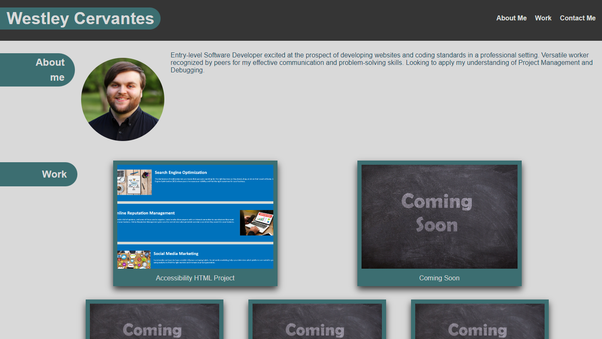

# Portfolio Website

## Description

This is my Portfolio Website designed to display my skills as I learn them. The projects I create will be added over time and for now I am giving an example of planning for the future updates. This really helps keep all live projects in one place and display them in an organized way.

## Usage

This is my Portfolio of projects I have fully running online. All links take you to either a live project or one of my contacts. The extra cards are there for future use. This is an ongoing project that will be updated over time.